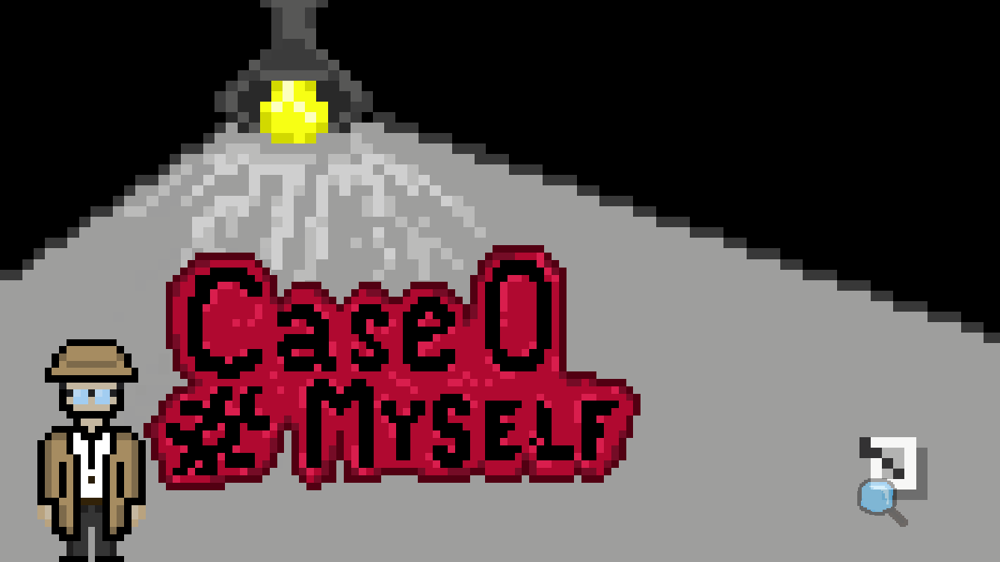
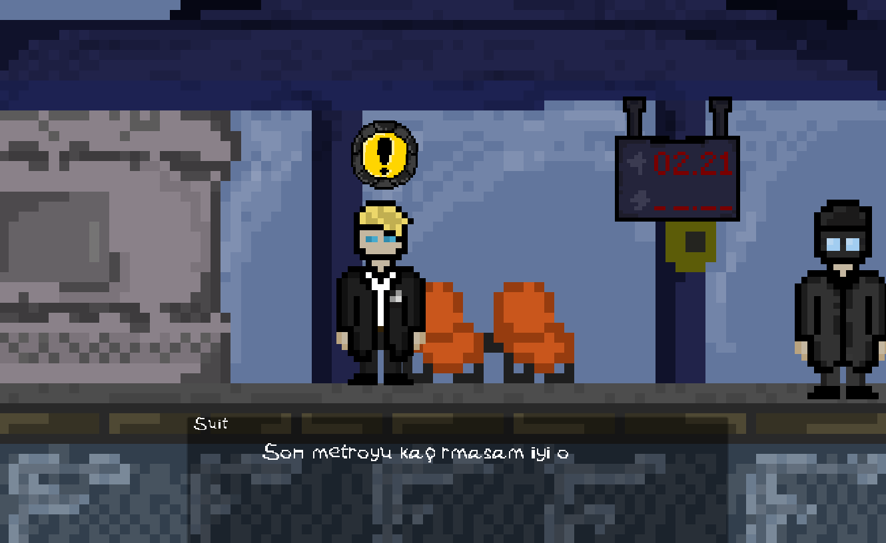
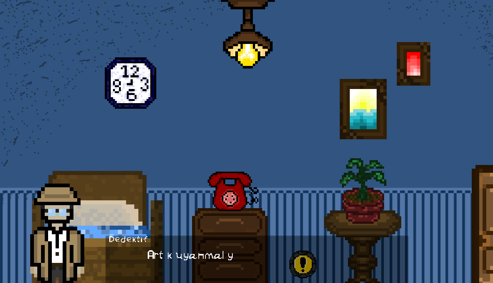
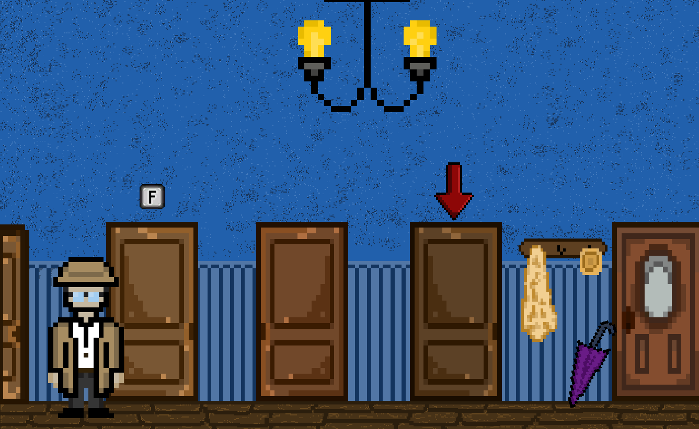
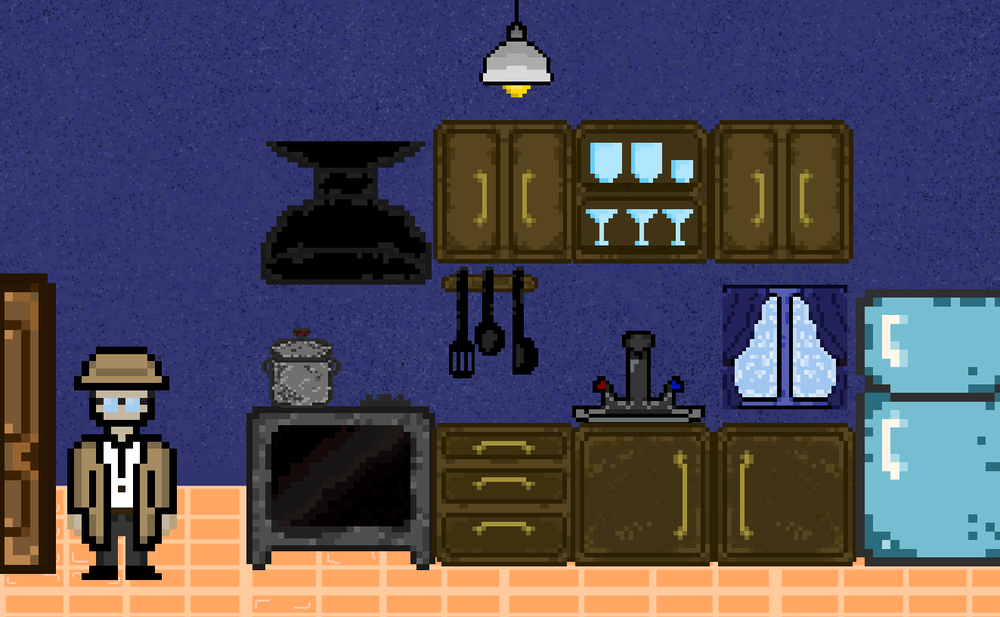
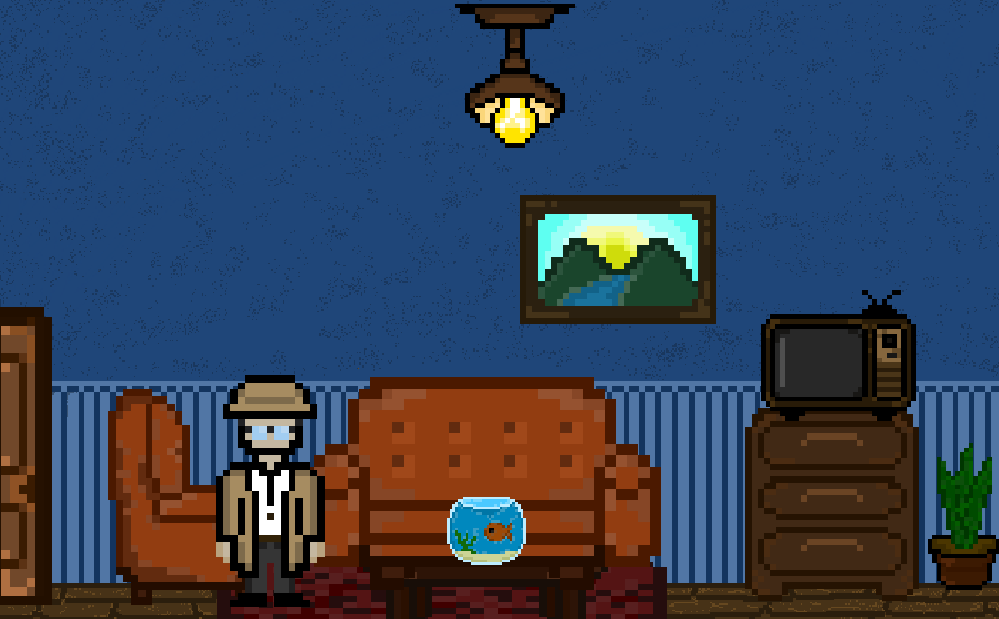
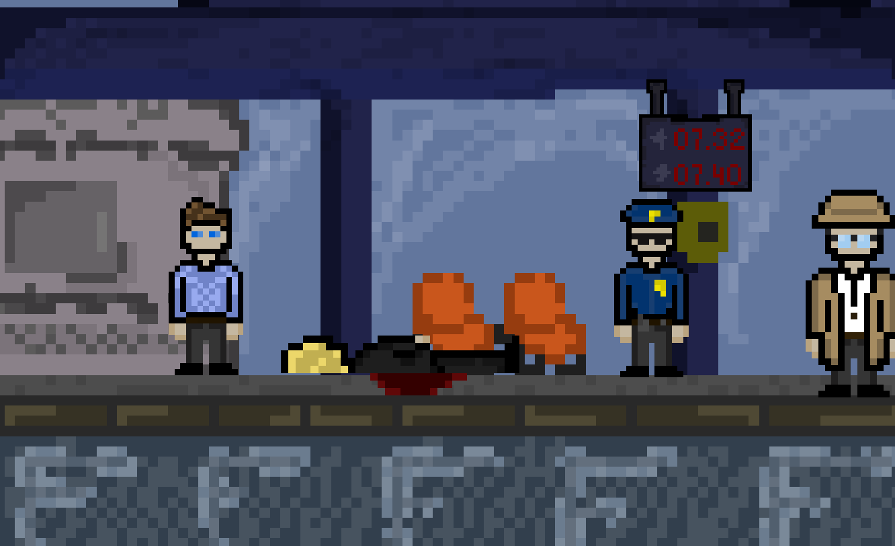
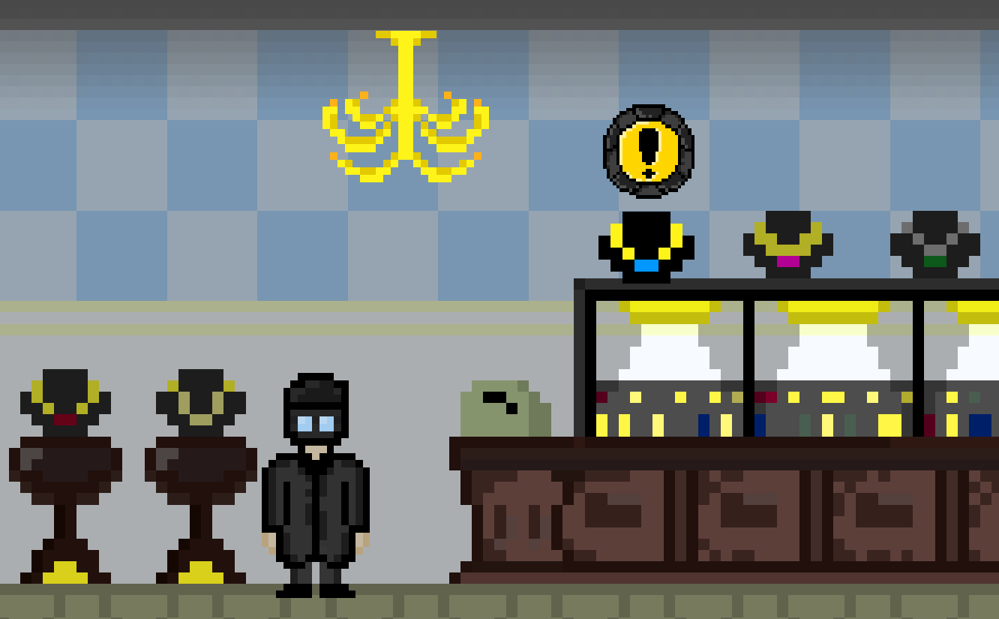
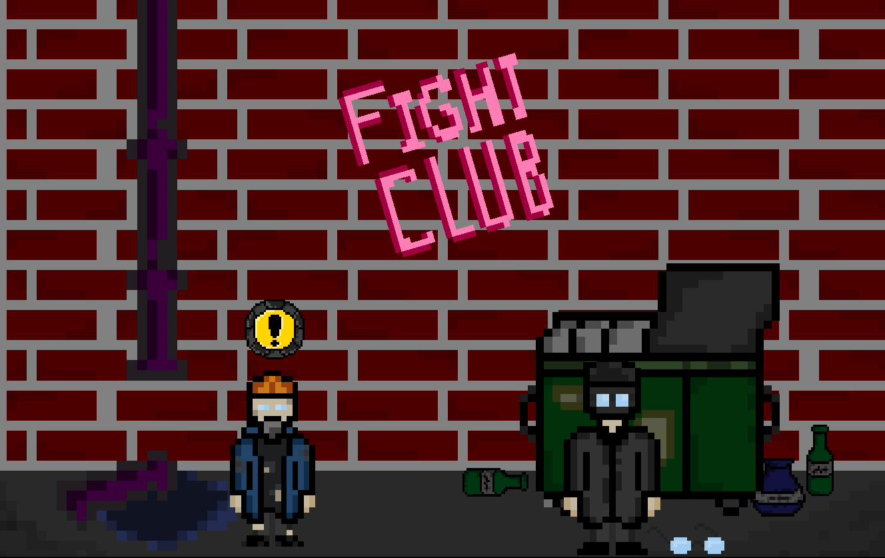

# Case 0: Myself 🕵️‍♂️🔦

> **A narrative-driven mystery and exploration game developed for a Game Jam.**

**Case 0: Myself** is an immersive story-driven mystery where our detective loses control and unknowingly commits crimes at night, only to wake up and try to solve those same crimes with his team during the day. As you navigate through intricate narrative steps, uncover clues, and interact with the environment to piece together this gripping case... a massive plot twist awaits you. Who are you really, and what is Case 0?

---

📺 **[Play the Game on Fiuby / Oyunu İncele](https://fiuby.com/games/case-0-myself)**

---

## 📸 Gallery & Screenshots

*A visual journey through the mystery of Case 0:*

---

## 🎮 Gameplay & Mechanics

Unlike action-heavy titles, **Case 0: Myself** focuses on storytelling, pacing, and atmosphere.

- **Story-Driven Progression (`GameManager` & `StoryStep`)**: The core of the game is its dynamic event system. The narrative is divided into specific "Story Steps" (e.g., Waking up in bed, entering the kitchen). 
- **Interactive Events (`StoryEventManager`)**: Progressing through steps automatically triggers environmental changes, animations, or unlocks new areas to explore, making the world feel reactive to your discoveries.
- **Deep Dialogue System**: Engaging conversations and internal monologues drive the plot forward, managed by a robust custom Dialogue Manager.

## 🛠️ Technical Details

Developed in **Unity (C#)** for a Game Jam.
The architecture is designed specifically for visual novels and interactive fiction:
- **Event-Driven Architecture**: Uses C# `Action` delegates (`OnStoryStepChanged`) to decouple the game logic, allowing any object in the scene to listen for story updates and react accordingly without heavy polling.
- **Custom Event Triggers**: The `StoryEventManager` maps UnityEvents to specific story milestones, allowing easy drag-and-drop narrative design in the inspector.

---

## License & Copyright

&copy; Ucmaz pc. All Rights Reserved.  
This project is proprietary and intended solely for educational, academic, and portfolio purposes. It is not licensed for commercial use, distribution, or modification without explicit permission.
